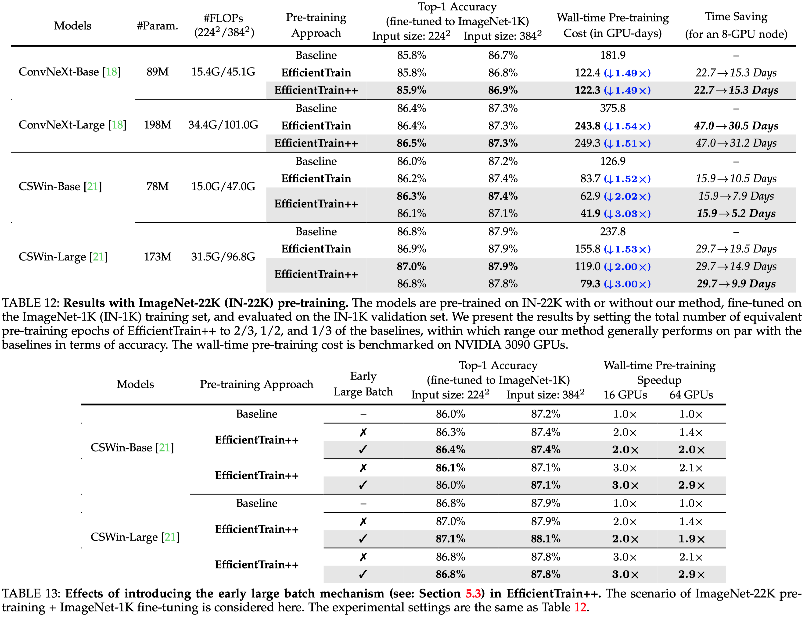
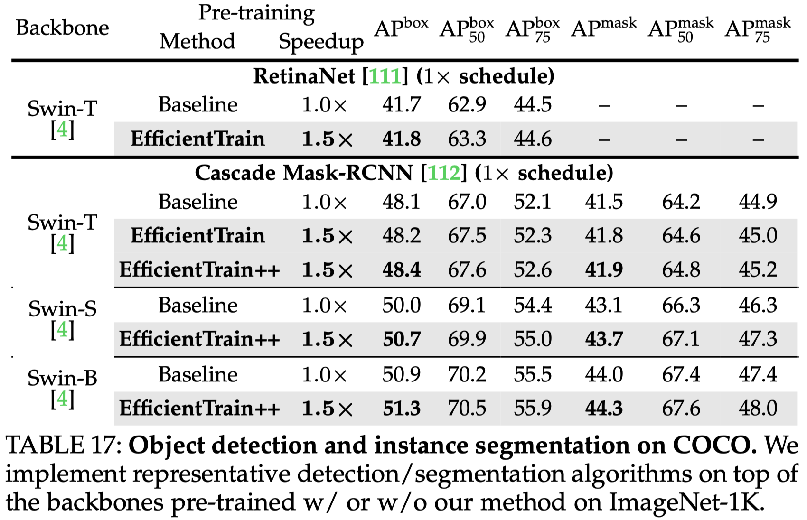

# EfficientTrain

This repo is used to release the code and pre-trained models for the **EfficientTrain** algorithm.

[EfficientTrain: Exploring Generalized Curriculum Learning for Training Visual Backbones](https://arxiv.org/abs/2211.09703). \
[Yulin Wang](https://www.rainforest-wang.cool/)\*, [Yang Yue](https://github.com/yueyang2000)\*, [Rui Lu](https://scholar.google.com/citations?user=upMvIv4AAAAJ&hl=zh-CN), [Tianjiao Liu](https://www.semanticscholar.org/author/Tianjiao-Liu/2570085), [Zhao Zhong](https://scholar.google.com/citations?user=igtXP_kAAAAJ&hl=en), [Shiji Song](https://scholar.google.com/citations?user=rw6vWdcAAAAJ&hl=zh-CN) and [Gao Huang](http://www.gaohuang.net/)\
Tsinghua University, Huawei, BAAI\
[[`arXiv`](https://arxiv.org/abs/2211.09703)]


## Overview

In this paper, we present a novel curriculum learning approach for the efficient training of visual backbones. Our algorithm, *EfficientTrain*, is simple, general, yet surprisingly effective. For example, it reduces the training time of a wide variety of popular models (e.g., ConvNeXts, DeiT, PVT, and Swin/CSWin Transformers) by more than 1.5× on ImageNet-1K/22K without sacrificing the accuracy. It is effective for self-supervised learning (i.e., MAE) as well.

<p align="center">
    
</p>


## Catalog
- [x] ImageNet-1K Training Code
- [x] ImageNet-1K Pre-trained Models 


## Installation
We support [Pytorch](https://pytorch.org/)>=1.8.0 and [torchvision](https://pytorch.org/vision/stable/index.html)>=0.9.0. Please install them following official instructions. An example is given in the following.
```
pip install torch==1.8.0+cu111 torchvision==0.9.0+cu111 -f https://download.pytorch.org/whl/torch_stable.html
```

Clone this repo and install required packages:
```
git clone https://github.com/LeapLabTHU/EfficientTrain
pip install timm==0.3.2 tensorboardX six
```
The instructions for preparing [ImageNet-1K/22K](http://image-net.org/) datasets can be found [here](https://github.com/facebookresearch/ConvNeXt/blob/main/INSTALL.md#dataset-preparation).

## Training
See [TRAINING.md](TRAINING.md) for the training instructions.


## Pre-trained Models & Evaluation
See [EVAL.md](EVAL.md) for the pre-trained models and the evaluation instructions.


## Results

### Supervised learning on ImageNet-1K
<p align="center">
    
</p>


### ImageNet-22K pre-training
<p align="center">
    
</p>


### Supervised learning on ImageNet-1K (varying training epochs)
<p align="center">
    
</p>

### Object detection and instance segmentation on COCO
<p align="center">
    
</p>


### Self-supervised learning results on top of MAE
<p align="center">
    
</p>


## TODO

**This repo is still being updated.**

- [ ] ImageNet-22K Training Code
- [ ] ImageNet-22K Pre-trained Models
- [ ] ImageNet-1K Self-supervised Learning Code (EfficientTrain + [MAE](https://arxiv.org/pdf/2111.06377.pdf)) 
- [ ] EfficientTrain + [MAE](https://arxiv.org/pdf/2111.06377.pdf) Pre-trained Models

## Acknowledgement

This repo is mainly developed on the top of [ConvNeXt](https://github.com/facebookresearch/ConvNeXt), we sincerely thank them for their efficient and neat codebase. This repo is also built using [DeiT](https://github.com/facebookresearch/deit) and [timm](https://github.com/rwightman/pytorch-image-models).


## Citation
If you find this repo helpful, please consider citing us.
```bibtex
@article{wang2022efficienttrain,
    title={EfficientTrain: Exploring Generalized Curriculum Learning for Training Visual Backbones},
   author={Wang, Yulin and Yue, Yang and Lu, Rui and Liu, Tianjiao and Zhong, Zhao and Song, Shiji and Huang, Gao},
  journal={arXiv preprint arXiv:2211.09703},
     year={2022}
}
```
