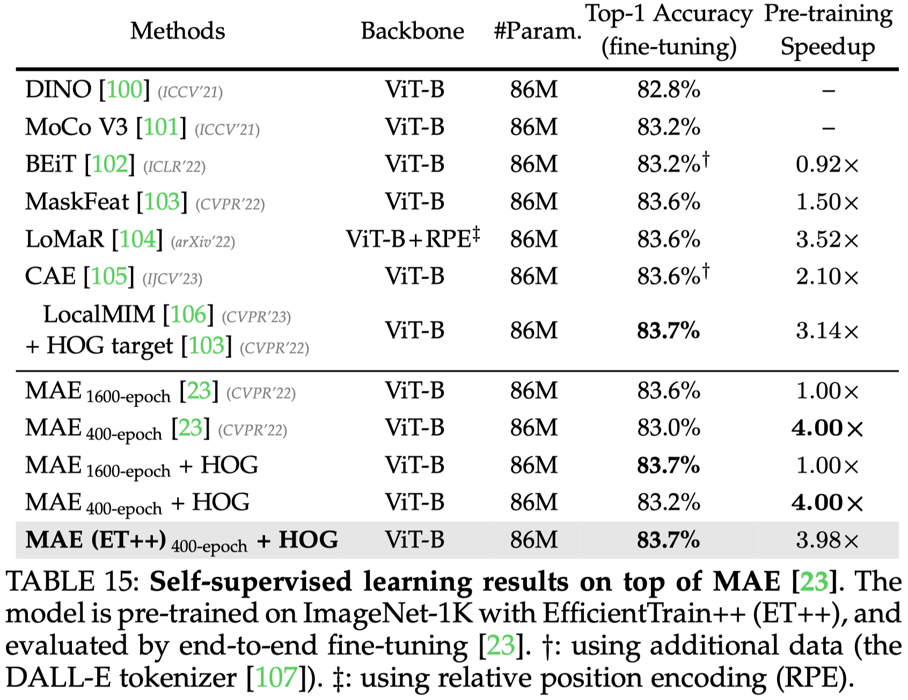

# EfficientTrain++ (TPAMI 2024 & ICCV 2023)

This repo releases the code and pre-trained models of **EfficientTrain++**, an off-the-shelf, easy-to-implement algorithm for the efficient training of foundation visual backbones.


[TPAMI 2024]
[EfficientTrain++: Generalized Curriculum Learning for Efficient Visual Backbone Training](https://arxiv.org/abs/2405.08768) \
[Yulin Wang](https://www.wyl.cool/), [Yang Yue](https://github.com/yueyang2000), [Rui Lu](https://scholar.google.com/citations?user=upMvIv4AAAAJ&hl=zh-CN), [Yizeng Han](https://yizenghan.top/), [Shiji Song](https://scholar.google.com/citations?user=rw6vWdcAAAAJ&hl=zh-CN), and [Gao Huang](http://www.gaohuang.net/)\
Tsinghua University, BAAI\
[[`arXiv`](https://arxiv.org/abs/2405.08768)]

[ICCV 2023]
[EfficientTrain: Exploring Generalized Curriculum Learning for Training Visual Backbones](https://arxiv.org/abs/2211.09703) \
[Yulin Wang](https://www.wyl.cool/), [Yang Yue](https://github.com/yueyang2000), [Rui Lu](https://scholar.google.com/citations?user=upMvIv4AAAAJ&hl=zh-CN), [Tianjiao Liu](https://www.semanticscholar.org/author/Tianjiao-Liu/2570085), [Zhao Zhong](https://scholar.google.com/citations?user=igtXP_kAAAAJ&hl=en), [Shiji Song](https://scholar.google.com/citations?user=rw6vWdcAAAAJ&hl=zh-CN), and [Gao Huang](http://www.gaohuang.net/)\
Tsinghua University, Huawei, BAAI\
[[`arXiv`](https://arxiv.org/abs/2211.09703)]

- *Update on 2024.05.14:* I'm highly interested in extending EfficientTrain++ to CLIP-style models, multi-modal large language models, generative models (*e.g.*, diffusion-based or token-based), and advanced visual self-supervised learning methods. I'm always open to discussions and potential collaborations. If you are interested, please kindly send an e-mail to me (wang-yl19@mails.tsinghua.edu.cn).


## Overview

We present a novel curriculum learning approach for the efficient training of foundation visual backbones. Our algorithm, **EfficientTrain++**, is simple, general, yet surprisingly effective. As an off-the-shelf approach, it reduces the training time of various popular models (*e.g.*, ResNet, ConvNeXt, DeiT, PVT, Swin, CSWin, and CAFormer) by **1.5−3.0×** on ImageNet-1K/22K without sacrificing accuracy. It also demonstrates efficacy in self-supervised learning (*e.g.*, MAE).

<p align="center">
    
</p>


## Highlights of our work
- **1.5−3.0×** lossless training or pre-training speedup on ImageNet-1K and ImageNet-22K. Practical efficiency aligns with theoretical performance. Both upstream and downstream performance are not affected.
- Effective for diverse visual backbones, including ConvNets, isotropic/multi-stage ViTs, and ConvNet-ViT hybrid models. For example, ResNet, ConvNeXt, DeiT, PVT, Swin, CSWin, and CAFormer.
- Dramatically improving the performance of relatively smaller models (*e.g.*, on ImageNet-1K, DeiT-S: 80.3% -> 81.3%, DeiT-T: 72.5% -> 74.4%).
- Superior performance across varying training budgets (*e.g.*, training cost of 0 - 300 epochs or more).
- Applicable to both supervised learning and self-supervised learning (*e.g.*, MAE).
- Optional techniques optimized for limited CPU/memory capabilities (*e.g.*, cannot support high data pre-processing speed).
- Optional techniques optimized for large-scale parallel training (*e.g.*, 16-64 GPUs or more).

## Catalog
- [x] ImageNet-1K Training Code
- [x] ImageNet-1K Pre-trained Models 
- [x] ImageNet-22K -> ImageNet-1K Fine-tuning Code
- [x] ImageNet-22K Pre-trained Models 
- [x] ImageNet-22K -> ImageNet-1K Fine-tuned Models 


## Installation
We support [PyTorch](https://pytorch.org/)>=2.0.0 and [torchvision](https://pytorch.org/vision/stable/index.html)>=0.15.1. Please install them following the official instructions. 

Clone this repo and install the required packages:
```
git clone https://github.com/LeapLabTHU/EfficientTrain
pip install timm==0.4.12 tensorboardX six
```
The instructions for preparing [ImageNet-1K/22K](http://image-net.org/) datasets can be found [here](https://github.com/facebookresearch/ConvNeXt/blob/main/INSTALL.md#dataset-preparation).

## Training
See [TRAINING.md](TRAINING.md) for the training instructions.


## Pre-trained models & evaluation & fine-tuning
See [EVAL.md](EVAL.md) for the pre-trained models and the instructions for evaluating or fine-tuning them.


## Results

### Supervised learning on ImageNet-1K
<p align="center">
    
</p>


### ImageNet-22K pre-training
<p align="center">
    
</p>


### Supervised learning on ImageNet-1K (varying training budgets)
<p align="center">
    
</p>

<p align="center">
    
</p>

### Object detection and instance segmentation on COCO
<p align="center">
    
</p>


### Semantic segmentation on ADE20K
<p align="center">
    
</p>


### Self-supervised learning results on top of MAE
<p align="center">
    
</p>


## TODO

This repo is still being updated. If you need anything, no matter it is listed in the following or not, please send an e-mail to me (wang-yl19@mails.tsinghua.edu.cn).
- [ ] A detailed tutorial on how to implement this repo to train (customized) models on customized datasets.
- [ ] ImageNet-22K Training Code
- [ ] ImageNet-1K Self-supervised Learning Code (EfficientTrain + [MAE](https://arxiv.org/pdf/2111.06377.pdf)) 
- [ ] EfficientTrain + [MAE](https://arxiv.org/pdf/2111.06377.pdf) Pre-trained Models

## Acknowledgments

This repo is mainly developed on the top of [ConvNeXt](https://github.com/facebookresearch/ConvNeXt), we sincerely thank them for their efficient and neat codebase. This repo is also built using [DeiT](https://github.com/facebookresearch/deit) and [timm](https://github.com/rwightman/pytorch-image-models).


## Citation
If you find this work valuable or use our code in your own research, please consider citing us:
```bibtex
@article{wang2024EfficientTrain_pp,
        title = {EfficientTrain++: Generalized Curriculum Learning for Efficient Visual Backbone Training},
       author = {Wang, Yulin and Yue, Yang and Lu, Rui and Han, Yizeng and Song, Shiji and Huang, Gao},
      journal = {IEEE Transactions on Pattern Analysis and Machine Intelligence (TPAMI)},
         year = {2024}
}
@inproceedings{wang2023EfficientTrain,
        title = {EfficientTrain: Exploring Generalized Curriculum Learning for Training Visual Backbones},
       author = {Wang, Yulin and Yue, Yang and Lu, Rui and Liu, Tianjiao and Zhong, Zhao and Song, Shiji and Huang, Gao},
    booktitle = {Proceedings of the IEEE/CVF International Conference on Computer Vision (ICCV)},
         year = {2023},
}


```
