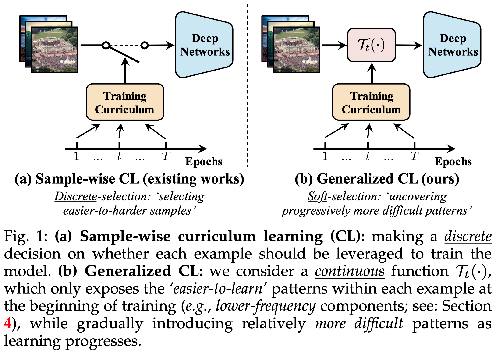
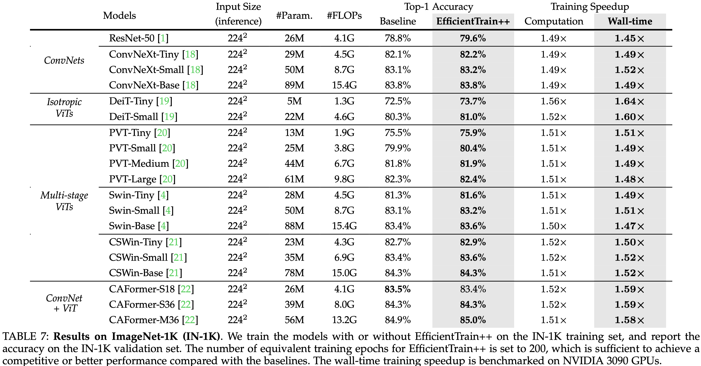
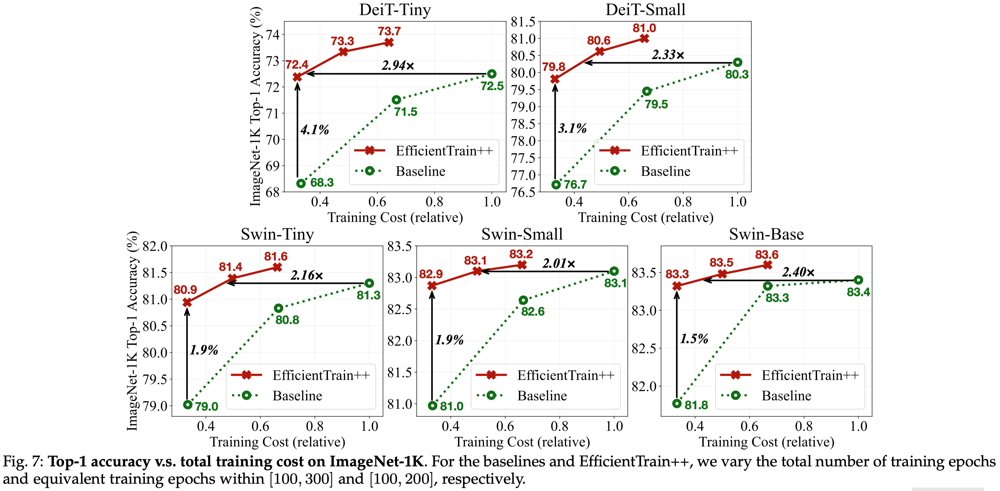

# EfficientTrain-PyTorch

This repo is used to release the code and pre-trained models for the EfficientTrain algorithm.

- [EfficientTrain: Exploring Generalized Curriculum Learning for Training Visual Backbones]()

**Update on 2022/11/15: Our experiments are conducted on Huawei Cloud. The code and pre-trained models are stored on the servers of Huawei. We are now applying for the permission to make them public. We will release all the code/models as soon as we get the permission.**

## Overview

In this paper, we present a novel curriculum learning approach for the efficient training of visual backbones. Our algorithm, *EfficientTrain*, is simple, general, yet surprisingly effective. For example, it reduces the training time of a wide variety of popular models (e.g., ConvNeXts, DeiT, PVT, and Swin/CSWin Transformers) by more than 1.5× on ImageNet-1K/22K without sacrificing the accuracy. It is effective for self-supervised learning (i.e., MAE) as well.

    

## Results

- Supervised learning on ImageNet-1K

    

- ImageNet-22K pre-training

    

- Supervised learning on ImageNet-1K (varying training epochs)

    

- Object detection and instance segmentation on COCO

    

- Self-supervised learning results on top of MAE

    

